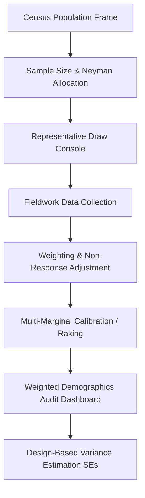

# 📊 Mr_Ed' Sampling Suite

<p align="center">
  
</p>

<p align="center">
  <strong>A Premium, Offline-First Scientific Survey Sampling, Calibration, Weighting, and Variance Estimation Suite for Official Statistics.</strong>
</p>

<p align="center">
  <a href="https://react.dev/"></a>
  <a href="https://typescriptlang.org/"></a>
  <a href="https://vite.dev/"></a>
  <a href="https://tailwindcss.com/"></a>
  <a href="#-gdpr-secure--offline-first"></a>
</p>

---

## 🌟 Overview

**Mr_Ed' Sampling Suite** is an advanced, high-performance web and desktop-wrapped dashboard designed for national statistics offices, survey researchers, and official statisticians. It offers professional, mathematically rigorous, and end-to-end control of the survey lifecycle—including **sample size planning**, **random sample drawing**, **non-response adjustment**, **multi-marginal demographic calibration (raking)**, and **stratified design-based variance estimation**—all executing completely locally on your computer with zero external database dependencies.

---

## 🔒 GDPR Secure & Offline-First

Unlike online AI tools or cloud-based data portals, **Mr_Ed' Sampling Suite runs 100% client-side inside local browser memory**. 
* **Zero Uploads:** Your census directories, population frames, and sensitive survey respondent records are never uploaded to any remote server or third-party cloud.
* **National Security Compliant:** Operates seamlessly on air-gapped computers, behind secure government firewalls, or inside national statistics security networks.
* **GDPR & HIPAA Compliant:** Safeguards personally identifiable information (PII) by design.

---

## 🚀 Key Modules & Capabilities



### 1. Executive Dashboard (System Control Center)
* **High-Performance Upload:** Instantly parse million-row census population files using an optimized client-side engine.
* **Global Stats Ribbon:** Tracks population frame parameters, active sample quotas, and calibrated response cases.
* **Dynamic Sidebar Navigation:** Seamlessly jump across the 6 major workflow modules using a premium glassmorphic interface.

### 2. Sample Size & Stratum Allocation Suite
* **Interactive Math Sandbox:** Calculate target sizes in real-time by dragging sliders for confidence levels ($1 - \alpha$), margins of error ($e$), expected proportions ($p$), or continuous standard deviations ($S$).
* **Flexible Estimators:** Toggle between **Cochran's Proportions Formula**, **Cochran's Continuous Mean**, and **Slovin's (Yamane)** equations.
* **Finite Population Correction (FPC):** Automatically detects if the sampling fraction exceeds 5% and compresses the variance dynamically.
* **Quota Allocation:** Distribute baseline sample sizes across geographic or demographic strata using **Proportional** or **Neyman Optimal Allocation** (which minimizes variance by targeting high-dispersion subgroups).

### 3. Interactive Methodology & Knowledge Hub
* **Methodology Timeline:** A visual, vertical lifecycle detailing the mathematical rationale, caveats, and R/SAS equivalence of every survey step.
* **Timed Grid Visualizer:** A 10x10 CSS-animated grid displaying unweighted vs. weighted unit drawing patterns for **SRS**, **Systematic**, **Stratified**, and **Cluster** designs.
* **Kish's Design Effect (Deff) Calculator:** Real-time dials simulating variance inflation factors due to clustering ($\text{Deff} = 1 + (m-1)\rho$) or unequal weighting dispersion ($\text{Deff} = 1 + \text{CV}(w)^2$).
* **Step-by-Step Raking IPF Solver:** A 2x2 dynamic table demonstrating how Iterative Proportional Fitting converges weights to demographics.

### 4. Advanced Weighting & Calibration Suite
* **Flexible Data Channels:** Calibrate weights using either the actively drawn sample or by uploading a external fieldwork survey dataset.
* **Non-Response Modeling:** Correct for demographic attrition using **Weighting Class Adjustments** or **Response Propensity Logistic Regressions**.
* **Three Calibration Engines:**
  1. **Multiplicative Raking (Ratio/IPF):** Fits multi-marginal demographics iteratively while keeping weight multipliers positive.
  2. **Linear Calibration (GREG Solver):** Uses single-step Lagrange equations equivalent to Generalized Regression estimators.
  3. **Logit Calibration:** Enforces strict boundary thresholds ($L \le w_i/d_i \le U$) to prevent excessive weight inflation.

### 5. Weighted Demographics & Representativeness Dashboard
* **Dissimilarity Index (D):** Compares unweighted vs. weighted distributions against target census margins.
* **Multi-Variable Chart Grid:** Beautiful comparative charts tracking category-level representativeness before and after weights calibration.
* **Audit Exports:** Export structured `.xlsx` demographic reports detailing counts, weighted percentages, target deviations, and average multiplier scales.

### 6. Variance & Analytics Engine
* **Stratified Taylor Series Linearization:** Computes design-based standard errors matching standard packages like R's `survey` or SAS's `PROC SURVEYMEANS`.
* **Bootstrap Replicas Resampling:** McCarthy-Snowden or Rao-Wu cluster bootstrap weight generation (e.g., 100 replicates).
* **Calibration Re-Estimation:** Re-calibrates every single replicate column during bootstrap iterations to capture calibration variance reductions perfectly.

---

## 🛠️ Technology Stack

* **Core Framework:** React 19.0, Vite 8.0, TypeScript 5.x
* **Styling & UI:** TailwindCSS 3.x, Lucide Icons, Glassmorphic space-mesh aesthetic
* **Excel Engine:** SheetJS (`xlsx`) for local client-side spreadsheet parsing and generation
* **Data Visualizations:** Chart.js + React-Chartjs-2 for high-resolution graphics
* **Math Notation:** LaTeX parsing for mathematical formula sandboxes

---

## 📦 Installation & Local Setup

To run the application locally on your computer:

### Prerequisites
Make sure you have [Node.js](https://nodejs.org) (v18 or higher) installed.

### Step 1: Clone the Codebase
```bash
git clone https://github.com/EDKOMANU/Sampling-Web-App.git
cd "mr-eds-sampling-suite"
```

### Step 2: Install Dependencies
```bash
npm install
```

### Step 3: Run the Development Server
```bash
npm run dev
```
Open [http://localhost:5173](http://localhost:5173) in your browser to view the application running locally!

### Step 4: Build for Production
To compile and package the app for web deployment:
```bash
npm run build
```
This generates a highly optimized, minified static site bundle inside the `/dist` directory.

---

## 📄 License

This project is licensed under a custom Enterprise Non-Distribution License. All core computation libraries, raking algorithms, and mathematical models operate locally and are fully owned by the workspace administrator.
